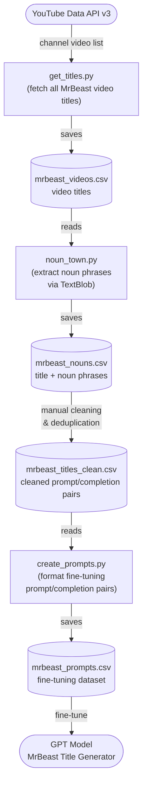

# MrBeast Title Generator

For more details on this project, check out my [blog post](https://batterylake.github.io/mrbeast.html)!

## How It Works

```mermaid
flowchart TD
    A([YouTube Data API v3]) -->|channel video list| B["get_titles.py\n(fetch all MrBeast video titles)"]
    B -->|saves| C[(mrbeast_videos.csv\nvideo titles)]
    C -->|reads| D["noun_town.py\n(extract noun phrases\nvia TextBlob)"]
    D -->|saves| E[(mrbeast_nouns.csv\ntitle + noun phrases)]
    E -->|manual cleaning\n& deduplication| F[(mrbeast_titles_clean.csv\ncleaned prompt/completion pairs)]
    F -->|reads| G["create_prompts.py\n(format fine-tuning\nprompt/completion pairs)"]
    G -->|saves| H[(mrbeast_prompts.csv\nfine-tuning dataset)]
    H -->|fine-tune| I([GPT Model\nMrBeast Title Generator])
```
